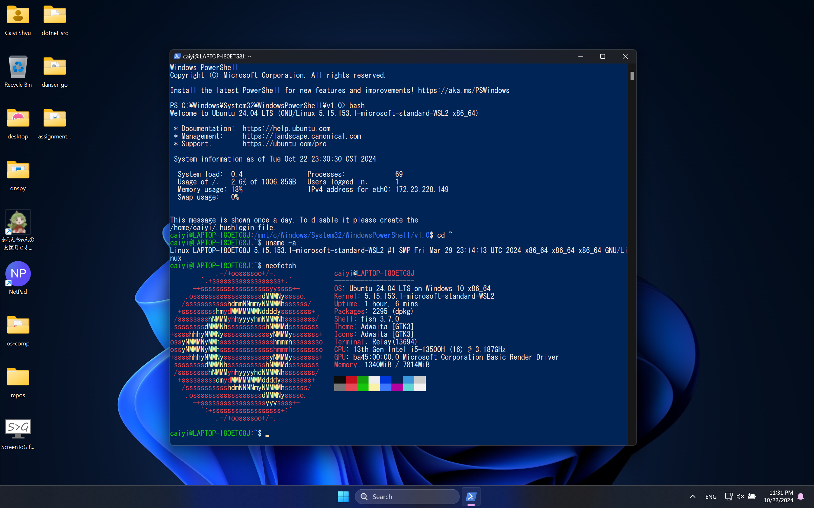
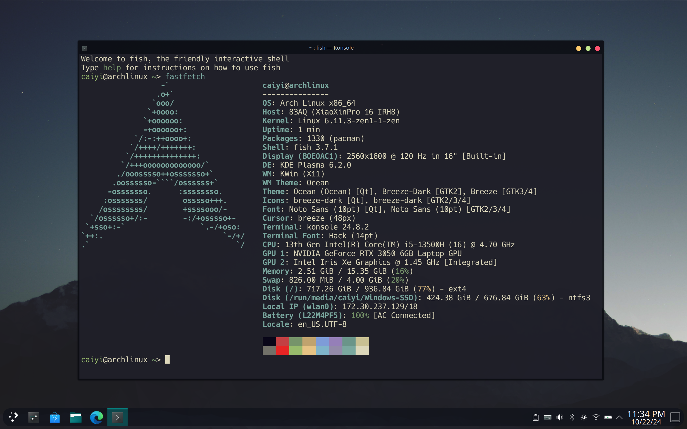
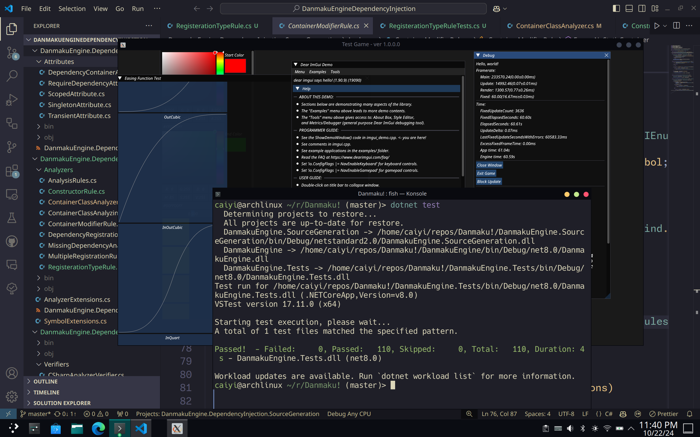

# My Linux Setup

## WSL2

打开 Control Panel，选择 Programs and Features，点击 Turn Windows features on or off，勾选 Windows Subsystem for Linux 和 Virtual Machine Platform，重启电脑。

打开 Microsoft Store，搜索并安装安装 Ubuntu 24.04 LTS。

打开 Start Menu，搜索并打开 Ubuntu 24.04 LTS，等待安装完成，输入用户名和密码。

### Screenshot

## Arch Linux Physical Machine

Download the latest Arch Linux ISO from [archlinux.org](https://archlinux.org/download/).

Open *Disk Management* and Wipe my secondary SSD. Partition it with a 2GB partition and the rest for another partition.

Flash the ISO to a USB drive with `dd` or [Rufus](https://rufus.ie/).

Disable BitLocker and reboot to UEFI, disable secure boot.

Boot from the USB drive to enter the Arch Linux installer.

Run `archinstall`. Create a FAT32 partition for EFI on the 2GB partition, and a BTRFS partition for the rest. Configure the rest of the installation and install the system.

Reboot, unplugging the USB drive and enter the new Arch Linux system.

Install `refind` and run `refind-install` so that I won't lose the ability to boot into Windows.

### Screenshot

